# Rapid Multi-hybrid Cloud Management of Kubernetes and Cloud-Native Facilities

Relentless global competition forces every organization to reinvent, improve, and deliver their capabilities better than their competitors every day. Applications and initiatives defined by the business, implemented by developers, and delivered by operators requires combining and coordinating each of their focused efforts efficiently to run and manage the business. Many significant challenges are encountered because the convergence of efforts also represents the potentially conflicting responsibilities of rapid innovation for developers, performance and stability by operators, and fiscal and secure governance by the business.

The global leaders in web-scale business have established and proven the modern manner to produce and scale their capabilities is cloud-native architectures and facilities. Most have settled on micro-service architectures, built and delivered as containers, running on Kubernetes with supporting facilities and operations. Because many of these technologies are open source and de-facto standards, the barriers to adoption are low. However, to achieve these goals, the organization must resolve the contention between teams, meet the challenges of gaining cloud-native skill sets and experience, while securing and managing the entire enterprise.

Nutanix Karbon Platform Services (KPS), a Platform as a Service (PaaS) offering which creates Kubernetes clusters anywhere, provides supporting cloud-native facilities to accelerate developer efforts, and manages them on multiple public and private clouds. KPS allows all of the organization's teams to align their efforts, vendors, and management from a single web console.

The remainder of this blog will serve as a tutorial showing you how to start with KPS by setting up governance, operations, and management!

---

## Direct KPS Login via "My Nutanix"

If you already a "My Nutanix" login for use with [https://my.nutanix.com](https://my.nutanix.com), Karbon Platform Services can be accessed via your My Nutanix portal.

- Login to [My Nutanix](https://my.nutanix.com) using your existing credentials
- Scroll down to the **Cloud Services** section and observe the link to **Karbon Platform Services**:

  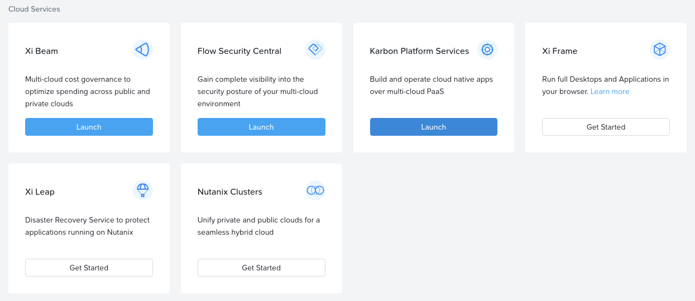

- Use the **Launch** button to open Karbon Platform Services.  Note that the login process uses Single-Sign-On (SSO) and should not require to re-enter your credentials, provided your existing My Nutanix session has not timed out.

Once you have logged into Karbon Platform Services via My Nutanix, please move on to the next section titled **Service Domains**.

## KPS Login via nutanix.com

The Karbon Platform Services console can also be accessed via the main [Nutanix website](https://www.nutanix.com).  If you would prefer to use this as your main KPS login method, continue below.

- Browse to the [Karbon Platform Services]([Karbon Platform Services](https://www.nutanix.com/products/karbon/platform-services) product page on the [Nutanix website](https://www.nutanix.com)
- Observe that logins through the KPS product page are available using the **My Nutanix** portal or by using a Local User Account

  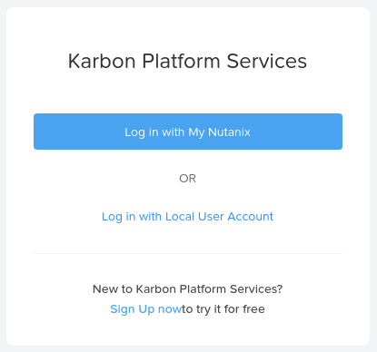

- Navigate to the **My Nutanix** login page by using the **Log in with My Nutanix** button provided
- In the exact same way outlined in the previous section, Single-Sign-On (SSO) is used to pass authentication through the Karbon Platform Services console

## Preparing for Service Domain VM Deployment

Because of the tight integration between Karbon Platform Services, Nutanix Acropolis and the Nutanix Prism Central Management UI, preparing to deploy the first service domain is a simple process.  The Image Services feature of Nutanix Acropolis provides a number of key capabilities:

- Centralised storage and management of disk images that can act as "base" VM disks
- Centralised import of images that were deployed to remote clusters
- Movement of images between VMs via the simplified attach and detach methods provided by Nutanix Prism (i.e. a disk used by one VM could easily be detached and re-attached to another VM)

With these base features in mind, it is easy to see how the Service Domain VM, covered shortly, can be deployed from an image hosted by Prism Central.

**Note**: This tutorial will assume you are deploying a KPS Service Domain as virtual machine on AHV.  This requires the use of the **Service Domain VM QCOW2 File for AHV** qcow2 image available on the Nutanix Support Portal.  Continue as follows.

- Login to the [My Nutanix](https://my.nutanix.com) portal
- Once logged in, click the "hamburger" icon at the top-left of the screen and select **Downloads**

  

- From the **Downloads** section, scroll to the **Apps & DevOps** section and select **Karbon Platform Services**

  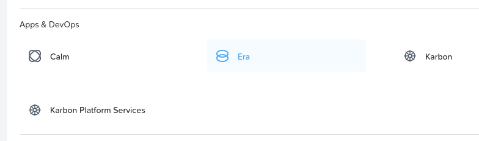

- Our Service Domain is going to be deployed as a VM running on AHV, necessitating the download of the image named **Service Domain VM QCOW2 File for AHV**

  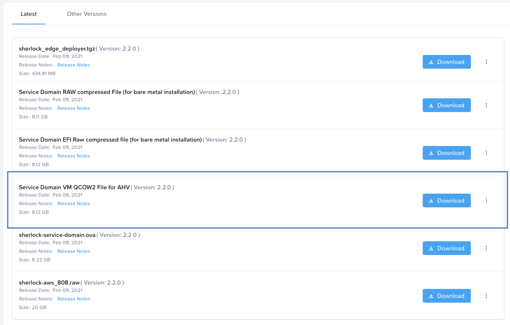

  **Quiz:** Why is the name **Sherlock** referred to throughout this tutorial and throughout the Karbon Platform Services documentation?

When the QCOW2 image download is complete, we now need to make sure the image is available in Prism Central.

- Login to Prism Central and, from the hamburger menu on the left, expand the **Virtual Infrastructure** branch and select **Images**.

  **Note:** This tutorial was created on a system running Prism Central version **pc.2021.1**.  Previous versions may show the sidebar menu slightly different, but all recent versions will have the **Images** item under the **Virtual Infrastructure** branch.

  **Another note:**: You may why these instructions are being reproduced here when they're already in the official Karbon Platform Services documentation.  Firstly, for completeness i.e. "packaging" of this tutorial and secondly because the official docs upload images using Prism Element.  We are concentrating our time in Prism Central.

- Using the **Add Image** button, browse to the .qcow2 file you downloaded in previous steps, then click **Next**

  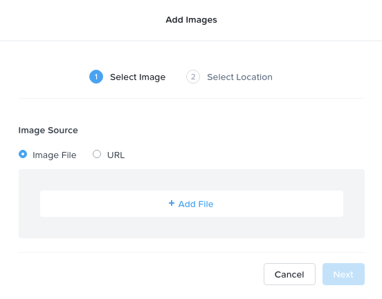

- At this point, you have the option of selecting which clusters will have access to the image you're about to upload.  In our demo environment, Prism Central is only managing a single Prism Element instance, meaning we can select **All Clusters**.  The placement of your images will depend on your requirements and which clusters you have access to.
- Lastly, when you are happy with your selections, click **Save** to begin the image upload process.

  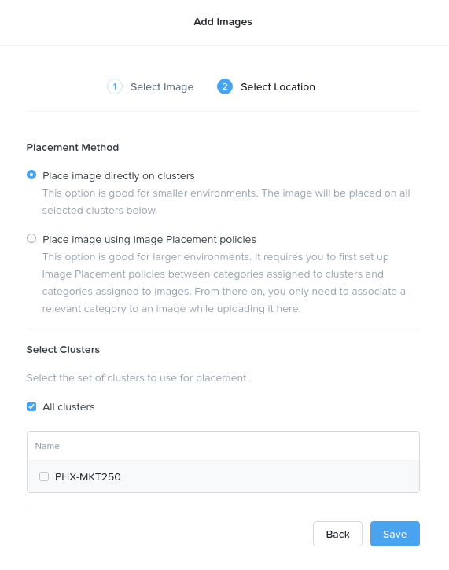

  **Note:** This process can take some time depending your connection speed and on how busy your Prism Central instance is.  To ensure the image is usable, please use the **Tasks** item under **Activity** in the sidebar menu and make sure the image has finished processing.

  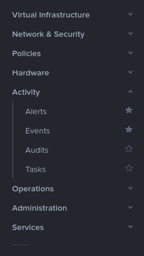

  As you can see in the example below, all image processing tasks have completed.

  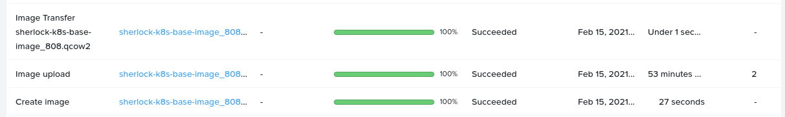

- Lastly, by opening the **Images** option under **Virtual Infrastructure** again, we can see our images are available.  The screenshot below shows **sherlock-k8s-base-image_808.qcow2** (the image that was uploaded for this tutorial), plus a previous Sherlock version and a third unrelated image for our demo environment's Ubuntu Linux management VM.

  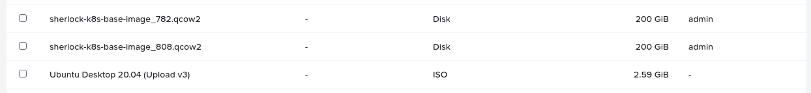

With our Sherlock image now uploaded, it is ready to be used in the next step - Service Domain deployment.

## Deploying Service Domain VM on AHV

As mentioned previous, this tutorial will make use of a Service Domain VM hosted by AHV.  The **Service Domain** is the interface between Karbon Platform Services that is hosted by Nutanix and the edge devices and services running in your environment.  By registering your Service Domain with Karbon Platform Services, the process of establishing communication between KPS and your devices is greatly simplified.

From a conceptual perspective, the Service Domain VM is just that - a virtual machine.  They are deployed and managed at cluster level the exact same way as any other VM hosted by AHV - our tutorial will focus on the **Single Node Service Domain** model, meaning we only need to deploy a single VM.  Karbon Platform Services also supports the deployment of a highly-available **Multinode Service Domain**, although this type of deployment is beyond the scope of this tutorial.  However, the official [Karbon Platform Services documentation](https://portal.nutanix.com/page/documents/details?targetId=Karbon-Platform-Services-Admin-Guide:ks-service-domain-multinode-add-t.html) covers this in excellent detail.

For this tutorial, please continue below.

- After logging into Prism Central, open the **Virtual Infrastructure** branch in the left sidebar, then select **VMs**

  **Note:** As with previous sections, this tutorial completes these steps using Prism Central, as opposed to the official documentation with uses Prism Element.  The end result is the same, however.

- After selecting the **Create VM** button, complete all required fields as follows.

  - Name your Service Domain VM something that will identify its function
  - Select the appropriate time zone for your VM - the time zone for your cluster will be at the **top** of the list
  - Configure the VM with **8x vCPUs**
  - Configure each socket with **1 core per vCPU**
  - Configure the VM with **16GB vRAM**
  - Leave the VM configured with the default **Legacy BIOS** under **Boot Configuration**
  - Add a new disk to the VM that is configured to **Clone from Image Service** and uses the image uploaded in previous steps (our tutorial uses the **sherlock-k8s-base-image_808.qcow2** image).  Ensure this is a **SCSI** disk.
  - Add a network adapter to the VM that is connected to a network with Internet access
  - Other settings such as **Agent VM** and **Host Affinity** do not require any specific setting for this tutorial
  - Click **Save** to create your VM
  - After a few moments (dependant on cluster state), your VM will be visible in the list of VMs (which should still be on your screen from previous steps)

    **Note:** Did you know Nutanix Acropolis VMs can be created via API?  For a developer-focused article about this process, please see the [Nutanix API v3 – Creating a Linux VM with Cloud-Init](https://www.nutanix.dev/2020/06/16/nutanix-api-v3-creating-a-linux-vm-with-cloud-init/) article and [Create Detailed VM](https://www.nutanix.dev/code_samples/create-detailed-vm/) code sample on Nutanix.dev.

  - As a final step, select your new VM in the list, click the **Actions** button and select **Power On**:

    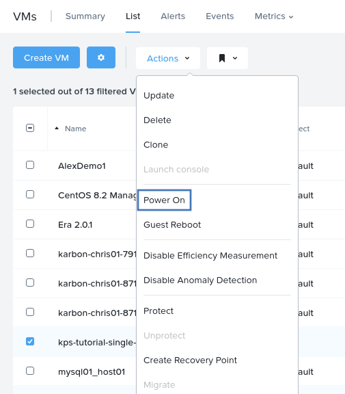

    Please give the new single node service domain VM a minute or so to start; startup times may vary depending on available cluster resources

Now that our Single Node Service Domain VM is created and running, we can procedd with onboarding the VM.

## Onboarding Existing Single Node VM

This section focuses on ensuring our previously-created Single Node Service Domain VM is available for and connected to Karbon Platform Services.  Please ensure you have access to the Karbon Platform Services console.

To complete this section, we first need to make sure we have noted down the Service Domain VM's serial number.  This serial number uniquely identifies the VM within both AHV and Karbon Platform Services.

- Within Prism Central, select the hamburger menu in the top-left, expand the **Virtual Infrastructure** branch and select VMs
- From the VM list, click the VM you created in previous steps
- In the VM details screen, note the VM's IP address, making sure not to confuse the VM IP with the host IP

  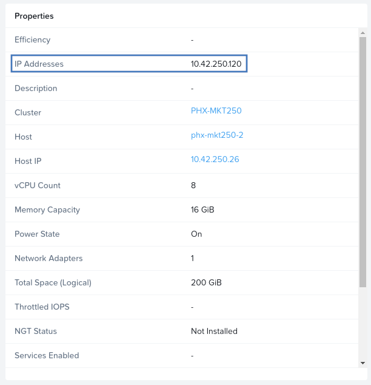

  Our single node service domain's IP is **10.42.250.120**.

- In your browser, browse to port `/v1/sn` on port 8080 of your service domain's IP address, e.g. `http://10.42.250.120:8080/v1/sn`
- Take note of the serial number shown:

  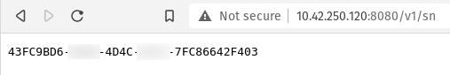

  **Note:** The VM's serial number is identical to the VM's ID within your Nutanix cluster, if the VM is hosted by Nutanix AHV.  Please note the VM's ID can be obtained by browsing to the VM list within **Prism Element**, as opposed to **Prism Central** used throughout this tutorial.

- From either [My Nutanix](https://my.nutanix.com) or the [Karbon Platform Services product page](https://www.nutanix.com/products/karbon/platform-services), login to Karbon Platform Services.  This process was covered in detailed in previous sections.
- After logging in to the Karbon Platform Services console, you will be prompted to add the first service domain (assuming one hasn't been added previously).  Select the **+ Add Service Domain** when ready
- In the window provided, enter the information that is relevant to your environment:

  - Service Domain name as per the naming conventions.  Names must be a maximum of 63 characters, start and end with a lower-case character, and only make use of special characters "dash" (`-`) and dot (`.`)
  - Select the Service Domain type.  In our tutorial we using the **Single Node** service domain type.
  - Enter the serial number, IP address, your default gateway and subnet mask (these will differ in almost every environment)
  - When all details are entered, click the blue "check mark" next to the Subnet Mask field; this will confirm your entries:

    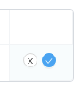

    **Note:** If changes are required after clicking the confirm button, the ellipsis dropdown menu can be clicked and the **Edit** option selected:

    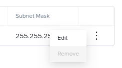
    
  - If required for your environment, selec the categories that will apply to this service domain.  Prism Central categories are used to apply, amongst other things, security policies to various entities.  For example, a VM may have "permission" to contact another specific VM but not another when using Nutanix Flow
  - In our demo environment, the completed service domain details are as follows (before clicking the confirm button):

    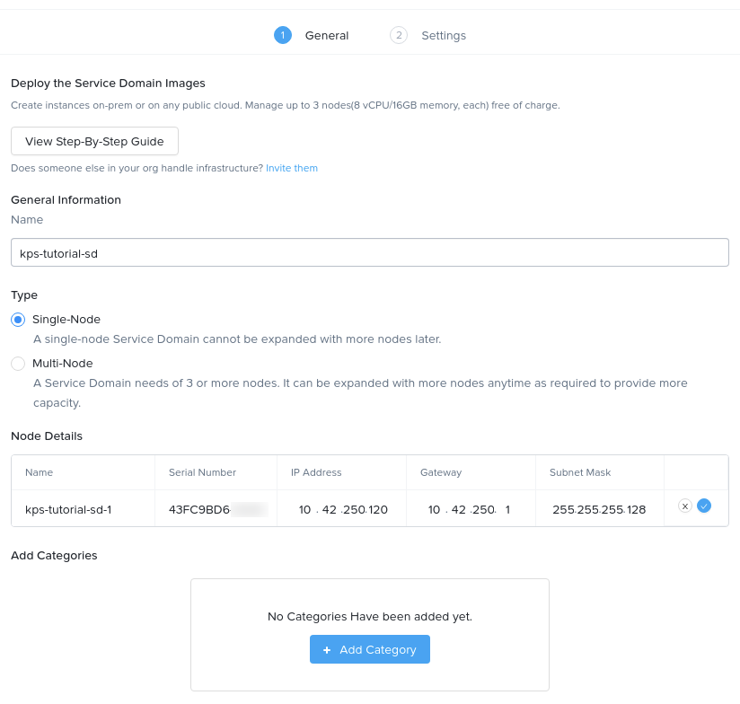

  - Selec the **Next** button and, if required, enter Kubernetes variables in the form of key/value pairs.  This is not mandatory for this tutorial.
  - In a real or production environment, AHV-exposed GPUs can be selected depending on the requirements of the service domain.  This is not mandatory for this tutorial.
  - Leave the SSH option disabled - in some environments the SSH option may not be selectable at all
  - Click the **Add** button
  - While the new Service Domain is being onboarded, Karbon Platform Services will show a status of **Not Onboarded**:

    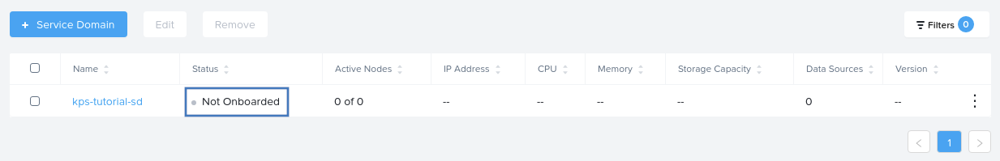

    **Note:** The onboarding process can take some time, depending on environmental conditions.  Please wait until the Karbon Platform Console shows the Service Domain status as **Healthy**:

    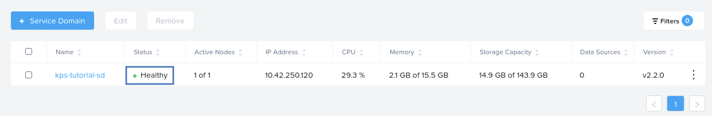

## Adding Karbon Cluster to Karbon Platform Services

In our current demo environment, Karbon Platform Services and Karbon are still somewhat "separated".  At this stage this is by design, since Karbon as a product simplifies the deployment and management of Kubernetes cluster infrastructure, whereas Karbon Platform Services simplifies the deployment and management of IoT applications running on Kubernetes clusters.

In this section, we will connect Karbon Platform Services to Karbon itself, allowing KPS to view and manage Karbon applications.  This process is supported on Kubernetes clusters hosted by Nutanix, AWS, Azure, GCP or others (to name a few).

**Note:** This section makes a small number of assumptions.  Firstly, that you have already deployed a Karbon-managed Kubernetes cluster in your environment and that your workstation/laptop/management device already has `kubectl` installed for Kubernetes Management.  This section verifies connectivity from a Linux system, although the steps are essentially identical for all operating systems with `kubectl` already installed.

### Configuring Karbon Cluster Connectivity

This section must be completed before continuing to import the Karbon cluster.

- Login to Prism Central using your credentials
- From the left sidebar, expand **Service** and select **Karbon**

  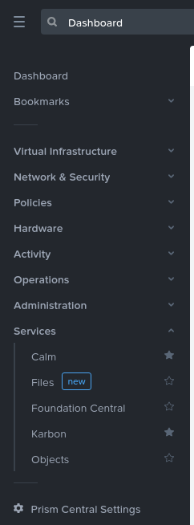

- From the Karbon console, observe the list of Karbon Kubernetes clusters that is available.  This list will vary in every environment.

  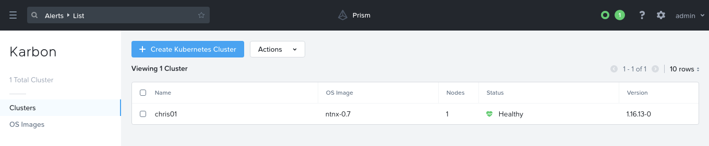

- With the appropriate cluster selected, click the **Actions** button and select **Download Kubeconfig**.  The Kubeconfig file is a system-generated YAML specification that gives our management workstation(s) permission to remotely manage our Karbon Kubernetes cluster.

  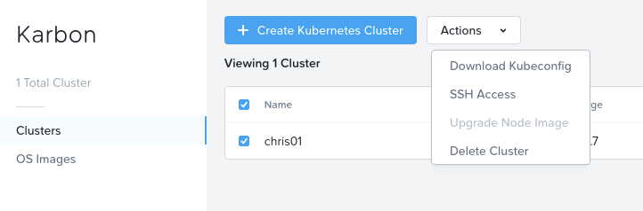

  **Note:** Ensure the Kubeconfig file is downloaded to the same system that has `kubectl` installed.

  In the screenshot below, observe the presence of `chris01-kubectl.cfg` and `karbon-importer.tgz` (which will be downloaded in the next section).

  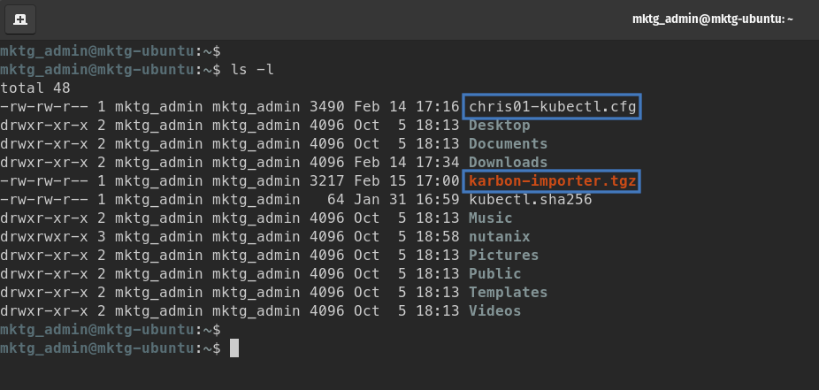

  **Note:** The downloaded Kubeconfig file contains an authentication token that is only valid for 24 hours.  If you have previously downloaded the Kubeconfig file for your cluster, it is possible to experience authentication failures when using expired tokens.

- From a terminal or SSH session, instruct `kubectl` which Kubeconfig file to use:

  ```
  export KUBECONFIG=/path/to/downloaded/kubeconfig/file
  ```

  In our demo environment, the command is as follows:

  ```
  export KUBECONFIG=~/chris01-kubectl.cfg
  ```

- Verify connectivity and operation of the Karbon Kubernetes cluster by listing the available worker nodes in the cluster:

  ```
  kubectl get nodes
  ```

  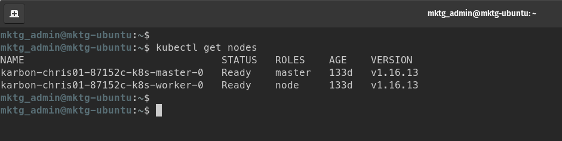

  As you can see, connectivity has been configured and verified with both the cluster master and single worker nodes being shown in the list.  It is worth noting that this demo environment is not suitable for production use, since both the master and worker nodes are single points of failure.

### Connecting Karbon Cluster to KPS

- Following the steps outlined in previous sections, login to Karbon Platform Services via [My Nutanix](https://my.nutanix.com), the [Karbon Platform Services product page](https://www.nutanix.com/products/karbon/platform-services) or by browsing to the [Karbon Platform Services Console](https://karbon.nutanix.com).
- Once logged in, verify that the Service Domain deployed in recent steps is still showing as **Healthy**.  Expand **Infrastructure** in the left sidebar, and select **Service Domains** to do this.

  

Now that we have verified the health of our Service Domain, our Karbon-managed Kubernetes cluster can be added to Karbon Platform Services as a managed entity.

- From the Karbon Platform Services console, use the top-left dropdown box to select **Kubernetes Clusters**.  Observe that by default no Kubernetes clusters are available within KPS.
- Click the **Import a Kubernetes Cluster** button and observe the dialog window that is displayed
- From the Karbon Platform Services download page, open the **Other Versions** tab and download the latest version of **karbon-importer.tgz**.  At the time of writing this tutorial, the latest karbon-importer.tgz version is **1.0.1**.

  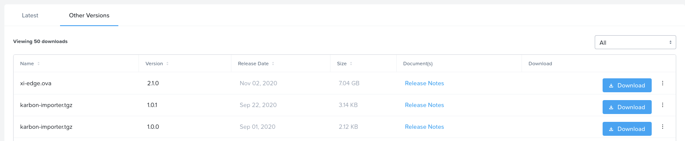

- Once the **karbon-importer.tgz** download has completed, extract the archive to your local system.  The steps below show an example of how this could be done on a Linux system.

  - Open a Linux terminal (Linux desktop) or SSH session to the location of **karbon-importer.tgz**
  - Extract the archive and view the extracted contents:

    ```
    tar xzvf karbon-importer.tgz
    ls -l ./karbon-importer/
    ```

    Ensure the archive has been extracted as per the screenshot below:

    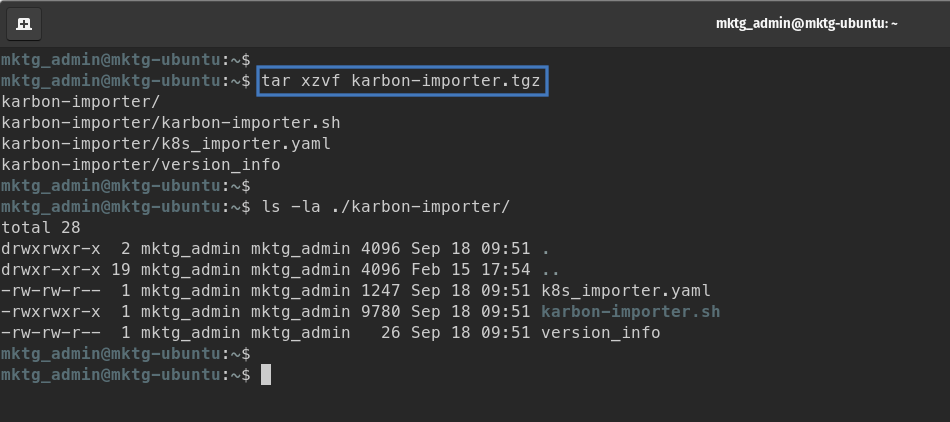

- In the dialog window that provided the Karbon Importer download link, enter the name of your cluster into the **Kubernetes Cluster Name** field, observing the cluster name being automatically transferred to the full command field below:

   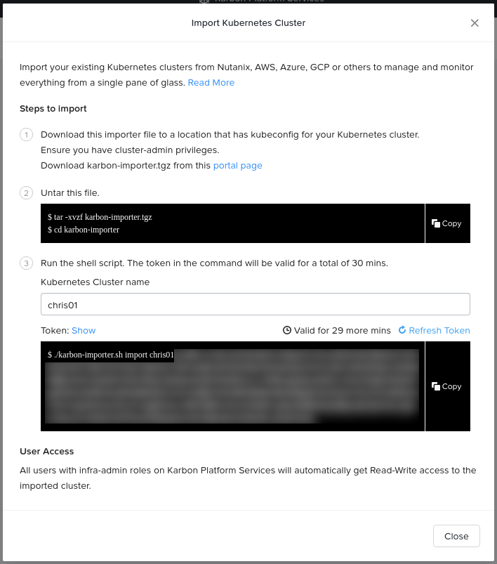

- With the Karbon importer script downloaded and extracted, it can be executed.  This process will register the Karbon cluster `chris01` with our Karbon Platform Services account.

  **Note:** Similar to Kubeconfig files, the generated authentication token is only valid for 30 minutes.  The generated token can be *regenerated* with the provided **Refresh Token** link.

  - Use the provided **Copy** button next to the cluster import command to ensure no errors are made when executing the script.

  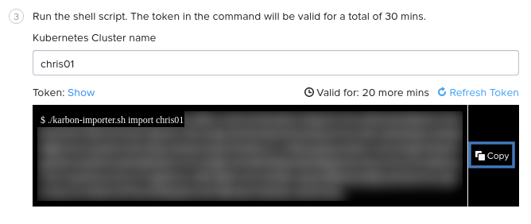

  - Using the same terminal session used to extract the archive, execute the script.  If you have used a new terminal session at a later time, it may be necessary to export a new Kubeconfig file and re-set the KUBECONFIG variable from the previous section.

    ```
    cd ./karbon-importer/
    ./karbon-importer.sh import chris01 <your_token_will_be_here>
    ```

  - Wait for the Karbon Importer process to complete, during which you will be provided with various status updates:

    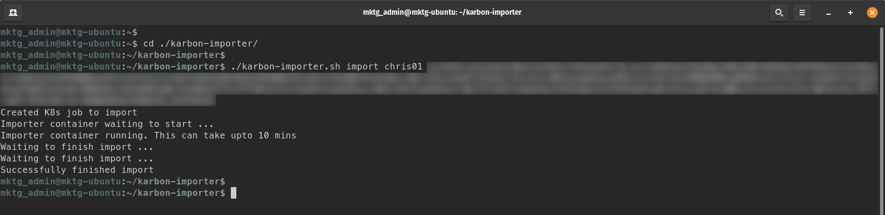

- When this process has completed, the Karbon Platform Services console can be used to verify cluster import.  If the download and script dialog is still active, click **Close** to dismiss it.  The browser session can then be refreshed to verify cluster import.

  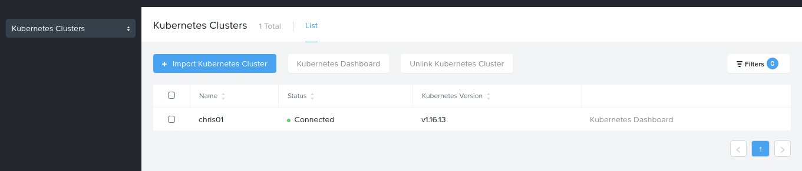

**TODO:** Figure out why registered Karbon clusters don't work in KPS console

---

## Karbon Platform Services: Log-in

At the top of the [Karbon Platform Services](https://www.nutanix.com/products/karbon/platform-services) product page, there is a log-in button and a free trial sign-up via Test Drive buttons. KPS is a PaaS that can be accessed directly via https://karbon.nutanix.com/ or you can log-in to your Nutanix account at https://my.nutanix.com: under the Cloud Services section, choose Karbon Platform Services.

Because KPS can create new and manage existing K8s clusters from different providers, it is important to establish basic governance first with roles for your teams and access to your infrastructure and Kubernetes providers.

Here are some KPS resources you should keep handy:

- [Articles](https://www.nutanix.dev/?s=kps) and [Labs](https://www.nutanix.dev/labs/#lab_kps)@Nutanix.dev Developer Portal with application, IoT, and database examples.
  - I recommend reviewing [From there to here, from here to there, Containers are everywhere!](https://www.nutanix.dev/2020/12/16/from-there-to-here-from-here-to-there-containers-are-everywhere/) and [Introducing Karbon Platform Services](https://www.nutanix.dev/2020/09/09/introducing-karbon-platform-services/) for KPS overviews directly from the Nutanix Product and Engineering teams.
- [Documentation](https://portal.nutanix.com/page/documents/list?type=software&filterKey=software&filterVal=Karbon%20Platform%20Services)@Nutanix Support Portal https://portal.nutanix.com/page/documents/details?targetId=Karbon-Platform-Services-Admin-Guide:ks-ks-onboarding-admin-c.html
- https://github.com/nutanix/karbon-platform-services Public Git Repository

## Set-up

## Service Domains
- Terraform
- Direct provisioning of:
  - https://github.com/nutanixdev/karbon-platform-services/tree/master/how_to/service_domain_deployment/baremetal
  - https://github.com/nutanixdev/karbon-platform-services/tree/master/how_to/service_domain_deployment/aws
  - Hands on Workshop: [KPS Service Domain deployment on AHV](https://nutanix.handsonworkshops.com/workshops/66418164-5f85-4c74-9803-72bac2d0c196/view/)
